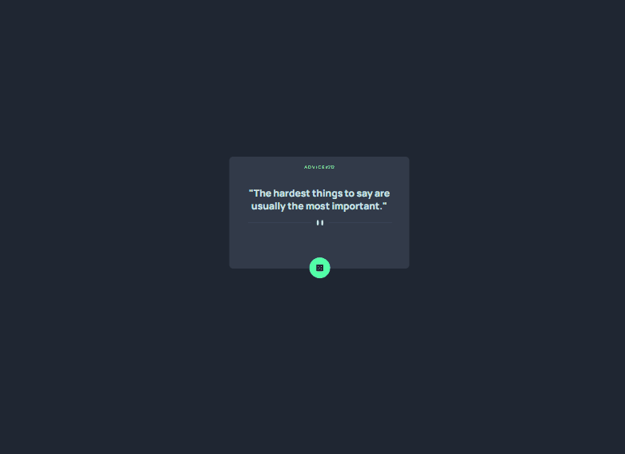

<h1>🚀 Aplicativo Gerador de conselhos 🚀</h1> 
<h2>Objetivo da Quest:</h2>

Usando um projeto feito anteriomente em outras aulas, apenas com HTML e CSS, foi proposto que utilizássemos uma API de conselhos para dar funcionalidade ao projeto.
Fazendo com que à cada click, fosse gerado um novo conselho.

# Gif Project

 

### Deployment

[Formulário]( )

## Técnologias Utilizadas:

   
 
 
 

### Redes:

- Linkedin - [Suelen Cardoso](https://www.linkedin.com/in/suelen-s-cardoso/)
